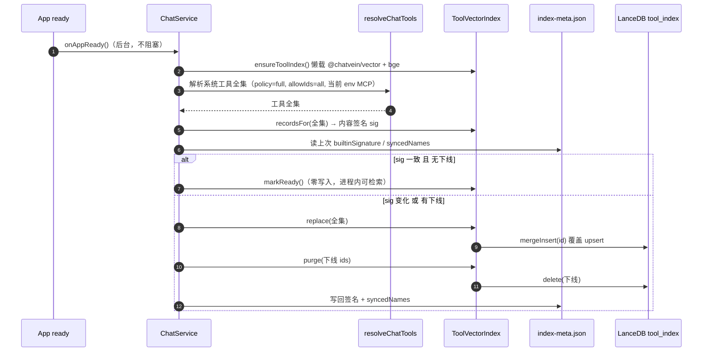
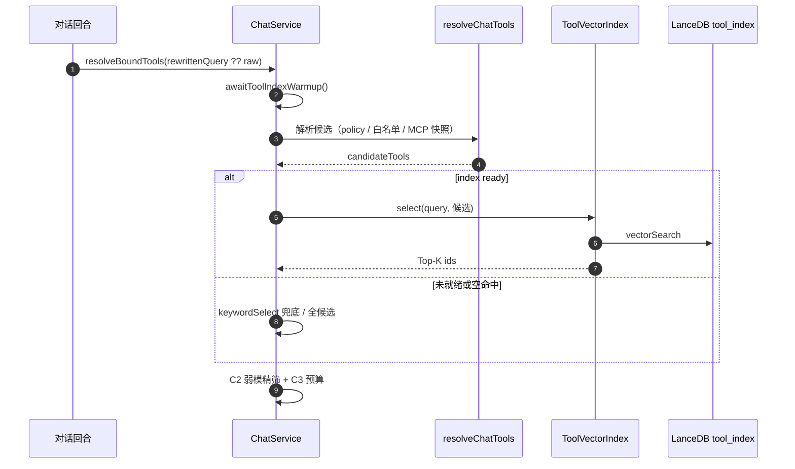

# Agent 工具层（`@chatvein/tools`）

> 版本：v0.5 ｜ 日期：2026-09-05  
> **决策状态：一期落地（目录 + MCP filesystem / openfile / modsearch）**  
> 上位：[`01-核心骨架.md`](./01-核心骨架.md)、[`02-agent循环方案.md`](./02-agent循环方案.md)、[`07-沙箱方案.md`](./07-沙箱方案.md)、[`11-L3-ReAct自适应循环推理层.md`](./11-L3-ReAct自适应循环推理层.md)  
> 实现：`packages/chatvein/tools`

---

## 1 定位一句话

**工具层 = L3 可调用能力的目录与治理壳**：按品类组织；**外部与文件系统能力优先经 MCP**；执行前做 `policy.tools ∩ role.tools` 求交、超时与输出截断；危险执行仍经沙箱（后续）。

| 做 | 不做 |
|----|------|
| 七大品类目录 + Chat 绑定 | 不替代 L1/L2 路由 |
| **MCP → LangChain tools**（`@langchain/mcp-adapters`） | 不为每个第三方再写专用适配包 |
| MCP filesystem **仅允许 `workspaceRoot`** | 不把宿主任意路径暴露给模型 |

---

## 2 接入优先级：MCP 优先

```
resolveChatTools({ workspaceRoot, mcpServers, mcpFilesystem?, mcpOpenfile?, mcpModsearch?, mcpVmsandbox?, mcpPyodide?, mcpPlaywright? })
  ├─ withDefaultMcpFilesystem(workspaceRoot)  → server `filesystem`
  ├─ withDefaultMcpOpenfile(workspaceRoot)    → server `openfile`
  ├─ withDefaultMcpModsearch()                → server `modsearch`（不依赖 workspace）
  ├─ withDefaultMcpVmsandbox(workspaceRoot)   → server `vmsandbox`（vm2 NodeVM；需 workspace）
  ├─ withDefaultMcpPyodide(workspaceRoot)     → server `pyodide`（Pyodide；需 workspace）
  ├─ withDefaultMcpPlaywright()               → server `playwright`（浏览器；不依赖 workspace）
  ├─ loadMcpTools(mcpServers)
  └─ catalog / community / 其它 builtin（计算、sqlite、fetch…）
       → createReactChatAgent({ tools })
```

| 来源 | 用途 |
|------|------|
| **MCP `filesystem`** | 本地读写/列/搜：`@modelcontextprotocol/server-filesystem`，args=`[workspaceRoot]` |
| **MCP `openfile`** | 系统文件管理器打开目录：`@chatvein/mcp-openfile-sdk`（文件 → 父目录） |
| **MCP `modsearch`** | 联网搜索 / 读页：`@chatvein/mcp-modsearch-sdk`（ModSearch → DuckDuckGo 兜底） |
| **MCP `vmsandbox`** | 工作区 JS：`@chatvein/mcp-vmsandbox-sdk`（NodeVM + 可信 npm；需 workspaceRoot） |
| **MCP `pyodide`** | 工作区 Python：`@chatvein/mcp-pyodide-sdk`（Pyodide + 可信包；需 workspaceRoot） |
| **MCP `playwright`** | 浏览器自动化：`@playwright/mcp`（默认 headless；不依赖 workspace） |
| **其它 MCP**（`CHATVEIN_MCP_SERVERS`） | 用户自带 server；可覆盖同名 server |
| **builtin** | `fetch_url` / `sqlite_query`；`js_eval` 默认关 |
| **community（过渡）** | calculator / wikipedia；`duckduckgo_search` 默认关 |

### 2.1 默认 MCP filesystem / openfile / modsearch / vmsandbox / pyodide / playwright

- filesystem：`@modelcontextprotocol/server-filesystem` → `filesystem__*`；目录 id `mcp_filesystem`
- openfile：`@chatvein/mcp-openfile-sdk`（`packages/mcps/openfile`）→ `openfile__*`；目录 id `mcp_openfile`
- modsearch：`@chatvein/mcp-modsearch-sdk`（`packages/mcps/modsearch`）→ `modsearch__*`；目录 id `mcp_modsearch`；**不依赖** workspace
- vmsandbox：`@chatvein/mcp-vmsandbox-sdk` → `vmsandbox__*`；目录 id `mcp_vmsandbox`；**需** workspace；默认仅 `scripts/`；require 仅工作区 node_modules，安装须过信任校验
- pyodide：`@chatvein/mcp-pyodide-sdk` → `pyodide__*`；目录 id `mcp_pyodide`；**需** workspace；默认仅 `scripts/**/*.py`；安装须过信任校验（loadPackage/micropip）
- playwright：`@playwright/mcp` → `playwright__*`；目录 id `mcp_playwright`；**不依赖** workspace；默认 `--headless`；需本机已装浏览器二进制
- 启动：`process.execPath` + 包内 CLI/entry（Electron 设 `ELECTRON_RUN_AS_NODE=1`）
- **无** builtin `read_file` / `list_dir` / `grep_search` / `shell.openPath`
- 关闭：`mcpFilesystem` / `mcpOpenfile` / `mcpModsearch` / `mcpVmsandbox` / `mcpPyodide` / `mcpPlaywright: false`，或 env 覆盖同名连接

**否决**：专用 CLI 包装包作默认联网（改走 MCP modsearch）；MCP filesystem **不带** workspace 根；local_fs builtin 后备；Electron `shell.openPath` 直接绑工具。  
**注意**：vmsandbox / pyodide ≠ design/07 工作区沙箱；vm2 已停维；Pyodide 为 WASM 软隔离。

其它 MCP 示例：

```bash
CHATVEIN_MCP_SERVERS='{"brave":{"command":"npx","args":["-y","@modelcontextprotocol/server-brave-search"],"env":{"BRAVE_API_KEY":"..."}}}'
```

---

## 3 与 `@langchain/community` 的关系

| 事实 | 我们的做法 |
|------|------------|
| `@langchain/community` **已 sunset** | 仅作残余过渡；新外部能力走 MCP |
| 本地文件 | **仅 MCP filesystem（限 workspace）**；无 builtin 读/列/grep |

---

## 4 七大品类

| 品类 id | 名称 | 一期默认可跑 | 需密钥 / 可选 |
|---------|------|--------------|---------------|
| `search` | 搜索 / 联网检索 | **MCP `modsearch__*`**（`mcp_modsearch`） | Brave / SerpAPI；community DDG 默认关 |
| `compute` | 计算 & 代码执行 | `calculator`、**MCP `vmsandbox__*` / `pyodide__*`** | Wolfram；builtin `js_eval` 默认关；真 shell → sandbox |
| `local_fs` | 本地文件 & 系统 | MCP `filesystem__*` + `openfile__*`（`mcp_filesystem` / `mcp_openfile`） | shell → 沙箱 |
| `web` | 网页解析 & 爬虫 | `fetch_url`、**MCP `playwright__*`** | **优先 MCP 读页 / 浏览器交互** |
| `news_finance` | 资讯 & 金融 | — | `google_trends` |
| `database` | 数据库 & 查询 | `sqlite_query` | 远程（二期） |
| `knowledge` | 通用知识库 & 实体 | `wikipedia`、`stackexchange` | 向量检索（CP2） |

---

## 5 契约

```ts
function resolveChatTools(options: {
  policy: 'none' | 'unknown' | 'full'
  allowIds?: string[] | 'all'
  workspaceRoot?: string
  secrets?: { … }
  mcpServers?: Record<string, McpServerConnection>
  /** 默认 true：有 workspaceRoot 时自动挂 filesystem MCP */
  mcpFilesystem?: boolean
  /** 默认 true：有 workspaceRoot 时自动挂 openfile MCP */
  mcpOpenfile?: boolean
  /** 默认 true：自动挂 modsearch MCP（不依赖 workspace） */
  mcpModsearch?: boolean
  /** 默认 true：有 workspaceRoot 时自动挂 vmsandbox MCP */
  mcpVmsandbox?: boolean
  /** 默认 true：有 workspaceRoot 时自动挂 pyodide MCP */
  mcpPyodide?: boolean
  /** 默认 true：自动挂 playwright MCP（不依赖 workspace） */
  mcpPlaywright?: boolean
}): Promise<StructuredToolInterface[]>

function createMcpFilesystemServer(workspaceRoot: string): McpServerConnection
function createMcpOpenfileServer(workspaceRoot: string): McpServerConnection
function createMcpModsearchServer(opts?: { timeoutMs?: number; fallback?: boolean }): McpServerConnection
function createMcpVmsandboxServer(workspaceRoot: string, opts?: { timeoutMs?: number; maxOutputChars?: number; allowAnyJs?: boolean }): McpServerConnection
function createMcpPyodideServer(workspaceRoot: string, opts?: { timeoutMs?: number; maxOutputChars?: number; allowAnyPy?: boolean }): McpServerConnection
function createMcpPlaywrightServer(opts?: { headless?: boolean; browser?: string; extraArgs?: string[] }): McpServerConnection
function withDefaultMcpFilesystem(...): ...
function withDefaultMcpOpenfile(...): ...
function withDefaultMcpModsearch(...): ...
function withDefaultMcpVmsandbox(workspaceRoot, ...): ...
```
横切：`timeoutMs`、`maxOutputChars`；MCP 用上游目录白名单；builtin 路径 jail。

---

## 6 L3 绑定

```
RouteDecision.policy.tools = full
  → resolveChatTools({
      allowIds, workspaceRoot: settings.effectiveWorkspaceRoot,
      mcpServers: parseMcpServersJson(process.env.CHATVEIN_MCP_SERVERS),
    })
  → createReactChatAgent({ tools })
```

---

## 7 分期

| 阶段 | 内容 |
|------|------|
| **T0（今）** | 目录 + MCP filesystem / openfile（workspace）+ env 其它 MCP |
| **T1** | MCP 设置页落盘；写操作与 `confirmWrites` 对齐 |
| **T2** | 危险执行走 `SandboxProvider`；MCP 与沙箱 cwd 统一 |
| **T3** | community 残余迁出 |

---

## 8 工具向量索引（C1 语义预筛）

> 实现：`packages/chatvein/tools`（原语）+ `app/src/main/chat`（装配 / 同步策略）  
> 数据：LanceDB `tool_index`（`@chatvein/vector`），落 `tmpdir()/chatvein-tool-index`；元信息 `index-meta.json` 同目录
> 检索文档：[`tool-selection-design.md`](../tool-selection-design.md) 层 C1

### 8.1 定位与查询路径

在 L2 弱模型精筛之前，对已解析候选做**混合粗召回** Top-K（`prescreenTopK=24`），减少弱模上下文里的无关工具：

1. **向量路**：LanceDB cosine（工具描述嵌入，`scope=tool` / `kind=tool_desc`）
2. **BM25 路**：进程内 MiniSearch（工具名 / humanize / 目录 keywords 别名 / title），CJK bigram 分词
3. **融合**：RRF（`vectorWeight=1`，`lexicalWeight=1.25`）；召回上限 `max(prescreenTopK, 候选数)`（用候选数抬高）

召回不足 / 未就绪 / 空 query 一律返回 `[]`，上层回退关键词或全候选（full），因此索引是**纯增益、无正确性依赖**。

```
一轮消息 → L1/L2 → resolveBoundTools(候选全集)
              └→ ToolVectorIndex.select(query, 候选)
                     ├─ store.search（向量）
                     ├─ ToolBm25Index.search（名/别名）
                     └─ RRF → Top-K ──▶ C2 弱模精筛
```

要点：工具名与 catalog `keywords` 是强信号，不能纯靠向量；warmup 签名命中跳过写库时 `markReady(tools)` 必须 hydrate 内存 BM25。

### 8.2 同步策略：启动全量基准 + 配置变更差量

避免「等第一轮对话才懒建」导致的空库 / 索引快照过期，改为：

| 场景 | 动作 | 触发 |
|------|------|------|
| **启动（内置基准）** | 解析**系统工具全集**（`resolveChatTools` full + all）→ 内容签名；与 `index-meta.json#builtinSignature` 一致且无下线 → **`markReady()` 零写入**；否则 `replace()` + `purge()` + 写回签名 | `ChatService.onAppReady()`，后台异步，失败仅告警 |
| **配置变更（差量）** | MCP 菜单 / `CHATVEIN_MCP_SERVERS` 变更后 `refreshToolIndex()`：相对 `syncedNames` 新增 `sync()`；**不做删除**（白名单收窄会误删），下线收敛到下次启动 warmup | 配置保存路径显式调用（**对话回合不 sync**） |
| **对话期（只读）** | 等待 warmup 完成后：`rewrittenQuery ?? 原文` → C1 **混合**预筛 → 关键词兜底 → C2 弱模精筛 → C3 预算；埋点 `c1=hybrid|keyword|full` | `resolveBoundTools` |

要点：

- 签名命中跳过写库时**必须** `markReady(tools)`（hydrate 内存 BM25），否则进程内 `built=false` 或别名路为空：向量页能看到行但 C1 空召回 / 退化为纯向量。
- 对话不维护索引：工具集在启动或 MCP 菜单变更时冻结进库。
- 工具检索 query 优先用路由 L2 的 `rewrittenQuery`。
- `VectorDbView` 只读浏览 `tool_index`，warmup 完成后刷新即可见。

### 8.3 时序图

启动 warmup（版本化全量基准）：



对话期只读检索（不再每轮 sync）：



### 8.4 代码落点

| 层 | 文件 | 职责 |
|----|------|------|
| 原语 | `packages/chatvein/tools/src/tool-vector-index.ts` | `recordsFor` / `build` / `replace` / `sync` / `purge` / `select` / `markReady` |
| 嵌入文本 | `packages/chatvein/tools/src/tool-embed.ts` | `toolEmbedText`：name + 目录描述 + schema 参数名 |
| 选用 | `packages/chatvein/tools/src/select.ts` + `select-prompt.ts` | C1 `keywordSelect`；C2 `withStructuredOutput` 优先、纯文本 JSON 兜底；C3 `fitToolsWithinBudget` |
| 元信息 | `app/src/main/chat/tool-index-meta.ts` | `index-meta.json` 读写、`toolIndexSignature` 签名 |
| 装配 | `app/src/main/chat/chat.service.ts` | `onAppReady` warmup、`refreshToolIndex`、对话只读 C1→C2→C3、`rewrittenQuery` 接线 |
| 存储 | `packages/chatvein/vector/src/store.ts` | `LocalVectorStore.remove(ids)` 批量删除（幂等） |
| 浏览 | `app/src/renderer/views/VectorDbView.vue` | 只读浏览 `tool_index` |

---

## 9 相关链接

- **挂载地图**：[13-Prompt-MCP-Tool挂载](./13-Prompt-MCP-Tool挂载.md)  
- L3：[11-L3-ReAct自适应循环推理层](./11-L3-ReAct自适应循环推理层.md)  
- 沙箱：[07-沙箱方案](./07-沙箱方案.md)  
- 依赖：[../phase1/04-依赖选型.md](../phase1/04-依赖选型.md)  
- 自研 MCP：`packages/mcps/`（[README](../../packages/mcps/README.md)）  
- **调试**：根目录 `pnpm mcp:inspect` / `mcp:inspect:openfile|modsearch|filesystem`（`@modelcontextprotocol/inspector`）  
- 代码：`packages/chatvein/tools`
