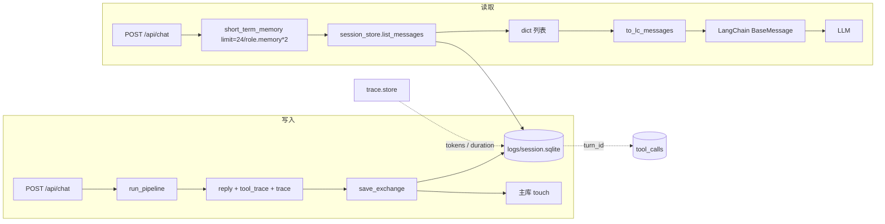

# 短期记忆实现方案

> 短期记忆（short-term memory）负责把「一个会话内最近若干轮对话」读出来，作为上下文回灌给本轮 Agent 执行。本文档梳理它在 chatvein 中的存储、读写、窗口策略与接线路径。

---

## 1. 设计原则

- **消息只在会话空间库**：主库（`conversations` 表）只存会话元数据（`id / title / workspace_dir / created_at / updated_at / skills`），具体消息、工具轨迹、推理字段全部落在会话工作区的 `logs/session.sqlite`。这样：
  - 会话级数据跟随 workspace 走，可随 workspace 归档 / 删除；
  - 主库始终轻量，会话列表 / 预览查询不必扫描消息表。
- **短期记忆 = 最近 N 条落库消息**：不做摘要、不做向量召回、不做跨会话检索——严格限定在"同一 `workspace_dir` 下最近 N 条"。
- **窗口以「条数」为单位**：`limit` 指消息行数（user + assistant 混合计数），不按 token 严格预算。
- **不回放 tool 消息**：`tool_calls` 是审计信息，只写不落回模型上下文，避免脏 `tool_call_id`。

---

## 2. 存储层：`logs/session.sqlite`

**位置**：`<workspace_root>/logs/session.sqlite`，`workspace_root = conversation_root(workspace_dir)`。每个会话独立一个 SQLite 文件。

**Schema**（`schema_version = 1`）：

```sql
-- 消息表：短期记忆的核心数据源
CREATE TABLE IF NOT EXISTS messages (
    id INTEGER PRIMARY KEY AUTOINCREMENT,
    role TEXT NOT NULL CHECK (role IN ('user', 'assistant', 'system', 'tool')),
    content TEXT NOT NULL,
    route TEXT,                              -- simple/medium/hard
    used_llm INTEGER NOT NULL DEFAULT 0,
    turn_id TEXT,                            -- 本轮 user+assistant 共享
    route_reason TEXT,                       -- 路由理由（understand 输出）
    tool_plan TEXT,                          -- medium/hard 的 tool_plan
    tokens INTEGER NOT NULL DEFAULT 0,
    duration_ms INTEGER NOT NULL DEFAULT 0,
    created_at TEXT NOT NULL
);
CREATE INDEX IF NOT EXISTS idx_messages_id ON messages(id);

-- 工具轨迹：独立表，用 turn_id 关联本轮 assistant 消息
CREATE TABLE IF NOT EXISTS tool_calls (
    id INTEGER PRIMARY KEY AUTOINCREMENT,
    turn_id TEXT,
    tool_name TEXT NOT NULL,
    tool_call_id TEXT,
    arguments_json TEXT,
    result_text TEXT,                        -- 超过 50_000 字截断
    status TEXT NOT NULL DEFAULT 'ok',
    created_at TEXT NOT NULL
);
CREATE INDEX IF NOT EXISTS idx_tool_calls_turn ON tool_calls(turn_id);

-- 元数据：schema 版本等
CREATE TABLE IF NOT EXISTS meta (key TEXT PRIMARY KEY, value TEXT NOT NULL);
```

**演进策略**：`ensure_session_db()` 在每次打开时幂等执行 DDL；对新增列走 `ALTER TABLE ... ADD COLUMN` 捕获 `duplicate column`；`tool_calls.turn_id` 若发现类型不对则整表 drop+rebuild。

代码索引：[session_store.py](file:///e:/project/chatvein/backend/conversations/session_store.py#L15-L91)

---

## 3. 读取路径

### 3.1 UI 历史：`ConversationsService.list_messages(conversation_id)`

- 通过 `_session_db_for(conversation_id)` 定位该会话的 `logs/session.sqlite`。
- 调 `session_store.list_messages(db, limit=500)`：先 `ORDER BY id DESC LIMIT ?` 取最近 N 条，再 `reversed` 还原为时间正序。
- **tokens / duration 事后补齐**：如果 assistant 消息的 `tokens=0` 或 `duration_ms=0`，用 `_trace_metrics_by_turn(db)` 从 `trace.store.list_turn_traces` 拿本轮总 tokens 和 elapsed，再 `session_store.apply_turn_metrics` 只回填 0 值字段（避免覆盖已落盘的更精确值）。

代码索引：[service.py: list_messages](file:///e:/project/chatvein/backend/conversations/service.py#L126-L152)、[session_store.py: apply_turn_metrics](file:///e:/project/chatvein/backend/conversations/session_store.py#L236-L252)

### 3.2 短期记忆：`ConversationsService.short_term_memory(workspace_dir, *, conversation_id, limit)`

给 Agent 用。签名看起来带 `conversation_id`，但实现忽略它——`workspace_dir` 是唯一入口，因为一个 workspace 就对应一个会话空间库。

```python
def short_term_memory(self, workspace_dir, *, conversation_id=None, limit=24):
    _ = conversation_id
    db = session_db_path(self.workspace_root_for(workspace_dir))
    return session_store.list_messages(db, limit=limit)
```

返回值是一批 dict，字段包括 `id / role / content / route / used_llm / turn_id / tokens / duration_ms / created_at`——注意比最终喂给 LLM 的消息更多元信息，方便日志与调试，不影响 `to_lc_messages` 的选取。

代码索引：[service.py: short_term_memory](file:///e:/project/chatvein/backend/conversations/service.py#L279-L289)

---

## 4. 写入路径

### 4.1 主链：`ConversationsService.save_exchange(...)`

被 `/api/chat` 命中。做三件事：

1. **主库 touch**：`_repo.touch_exchange(cid, title_hint=...)` 更新会话 `updated_at` 与首次 title。
2. **会话库写入 user + assistant**：`session_store.append_message(db, "user", user_text, route=...)` 和 `session_store.append_message(db, "assistant", reply_text, route=..., used_llm=..., turn_id=..., route_reason=..., tool_plan=..., tokens=..., duration_ms=...)`。**`turn_id` 由调用方传入或生成一次**（`uuid.uuid4().hex`），user / assistant / tool_calls 共享。
3. **写入 tool_trace**：每条 `tool_calls.append` 一次，同样挂 `turn_id`。

返回 `(conversation_id, user_message_record, assistant_message_record)` 给上层组装 HTTP 响应。

代码索引：[service.py: save_exchange](file:///e:/project/chatvein/backend/conversations/service.py#L193-L265)

### 4.2 遗留链：`record_turn(...)`

按 `workspace_dir` 写入（不落主库），早期 pipeline 直接调用，现在仍以兼容路径保留。写入内容与 `save_exchange` 中的会话库部分完全一致，但不做主库 touch。

代码索引：[service.py: record_turn](file:///e:/project/chatvein/backend/conversations/service.py#L291-L332)

### 4.3 撤回 / 停止：`delete_last_exchange`

会话级撤回最近一轮（user + assistant + 该轮 tool_calls）。带双防护避免误删：

- `user_content` 若传入，须与最近一条 user 消息的 `strip()` 结果相等；
- `after_message_id` 若传入，须小于最近 user 消息的 `id`（相当于"baseline"锚点，防止并发新消息插入后误删）。

任一校验不通过返回 `0`，不做删除。删消息后同步 `DELETE FROM tool_calls WHERE turn_id = ?`。

代码索引：[session_store.py: delete_last_exchange](file:///e:/project/chatvein/backend/conversations/session_store.py#L153-L191)、[service.py: delete_last_exchange](file:///e:/project/chatvein/backend/conversations/service.py#L154-L181)

---

## 5. 送入 Agent：`to_lc_messages`

`backend/agents/memory.py` 只有一个函数：把落库消息转成 LangChain 的 `BaseMessage` 列表。

```python
DEFAULT_HISTORY_LIMIT = 24

def to_lc_messages(history, *, limit=DEFAULT_HISTORY_LIMIT) -> list[BaseMessage]:
    if not history:
        return []
    rows = history[-max(1, limit):]
    out: list[BaseMessage] = []
    for row in rows:
        role = str(row.get("role") or "")
        content = str(row.get("content") or "").strip()
        if not content:
            continue
        if role == "user":
            out.append(HumanMessage(content=content))
        elif role == "assistant":
            out.append(AIMessage(content=content))
        elif role == "system":
            out.append(SystemMessage(content=content))
        # tool 角色不直接回灌，避免无绑定 tool_call_id 的脏消息
    return out
```

关键行为：

- 按 `limit` 从**尾部**截取（`history[-max(1, limit):]`），即"最近 N 条"；
- 空 `content` 跳过（撤回 / 停止留空的占位不会污染上下文）；
- `tool` 角色一律跳过——工具结果通过 `tool_trace` 结构化记录，不参与上下文回灌；
- **不做去重、不做轮次配对**：如果最近 N 条刚好以 user 结尾或 assistant 开头，就原样返回。当前 `limit` 都是偶数或允许不配对。

代码索引：[memory.py](file:///e:/project/chatvein/backend/agents/memory.py)

---

## 6. 窗口策略

**默认 24 条**（`DEFAULT_HISTORY_LIMIT = 24`），来自 main.py：

```python
memory_limit = 24
if role_runtime and role_runtime.get("memory") is not None:
    try:
        memory_limit = max(0, min(60, int(role_runtime["memory"]) * 2))
    except (TypeError, ValueError):
        memory_limit = 24
```

- 角色 `memory` 字段是"轮次数"，乘 2 转成消息条数（每轮 = 1 user + 1 assistant）；
- 硬 clamp 到 `[0, 60]`：0 表示完全无上下文，60 是硬上限（约 30 轮）；
- 类型异常回退到 24。

代码索引：[main.py](file:///e:/project/chatvein/backend/main.py#L175-L185)

---

## 7. 与 LangGraph 流水线的接线

调用链（自上而下）：

```
POST /api/chat
  └─ main.py chat()
       ├─ conversations_service.short_term_memory(workspace_dir, limit=memory_limit)
       │      → list_messages(limit=N)   → 最近 N 条 dict
       ├─ run_chat(message, history=history, role=role_runtime)
       │      → run_pipeline(message, history=..., role=...)
       │            → build_pipeline().invoke({"message", "history", "role"})
       │                  ├─ understand: router.understand(text, role=role)   # 只吃本轮，不吃 history
       │                  ├─ simple  → run_simple(text, history=..., ...)    # history → to_lc_messages → LLM
       │                  ├─ medium  → run_medium(text, history=..., ...)
       │                  └─ hard    → run_hard  (text, history=..., ...)
       └─ save_exchange(cid, user_text, reply_text, ...)   # 写回会话库
```

要点：

- `history` 作为 `ChatState.history` 字段一路传递（`_simple_node / _medium_node / _hard_node` 里 `list(state.get("history") or [])`）；
- 各子图的 `run_*` 内部对 `history` 调 `to_lc_messages` 再拼 system prompt + 本轮 user 句；
- `understand`（意图理解 / 难度判定）**不吃 history**，只做单句改写与路由；这样路由不受历史噪声干扰。

代码索引：[pipeline.py](file:///e:/project/chatvein/backend/agents/graphs/pipeline.py)、[service.py (agents)](file:///e:/project/chatvein/backend/agents/service.py)

---

## 8. 边界情况

| 场景 | 处理 |
| --- | --- |
| 撤回 / 停止后剩余空占位 | `to_lc_messages` 跳过空 `content` |
| 并发新消息插入后误删 | `delete_last_exchange` 的 `after_message_id` baseline 校验 |
| assistant 消息 `tokens=0` | `list_messages` 用 trace 事后补齐，`apply_turn_metrics` 只补 0 值 |
| 工具结果超大 | `append_tool_call` 硬截断到 50_000 字并追加 `\n…(截断)` |
| 角色未配置模型 | main.py 提前返回 `reply="暂未给角色配置模型"` + 独立 `turn_id`，跳过 Agent 但**仍然 save_exchange**，让撤回 / 历史可查 |
| 首次对话无 history | `short_term_memory` 返回 `[]`，`to_lc_messages` 返回 `[]`，Agent 只带 system prompt |
| 会话 workspace 缺失 | `_session_db_for` 返回 `None`，`list_messages` / `delete_last_exchange` 短路返回空 / 0 |
| 跨 workspace 混入 | 由 `session_db_path(workspace_root_for(workspace_dir))` 路径约束，天然隔离 |

---

## 9. 关键源码索引

| 位置 | 说明 |
| --- | --- |
| [backend/agents/memory.py](file:///e:/project/chatvein/backend/agents/memory.py) | `to_lc_messages` 与 `DEFAULT_HISTORY_LIMIT` |
| [backend/conversations/session_store.py](file:///e:/project/chatvein/backend/conversations/session_store.py) | SQLite schema、`append_message` / `list_messages` / `delete_last_exchange` / `apply_turn_metrics` / `append_tool_call` |
| [backend/conversations/service.py: short_term_memory](file:///e:/project/chatvein/backend/conversations/service.py#L279-L289) | 对外短记忆读取入口 |
| [backend/conversations/service.py: save_exchange](file:///e:/project/chatvein/backend/conversations/service.py#L193-L265) | 主写入路径 |
| [backend/conversations/service.py: list_messages](file:///e:/project/chatvein/backend/conversations/service.py#L126-L152) | UI 历史读取 + trace 补齐 |
| [backend/agents/service.py](file:///e:/project/chatvein/backend/agents/service.py) | `run_chat` 转发 |
| [backend/agents/graphs/pipeline.py](file:///e:/project/chatvein/backend/agents/graphs/pipeline.py) | `run_pipeline` / `_simple_node` / `_medium_node` / `_hard_node` |
| [backend/main.py](file:///e:/project/chatvein/backend/main.py#L175-L185) | `memory_limit` 计算 + `short_term_memory` 调用 |

---

## 10. 数据流图


