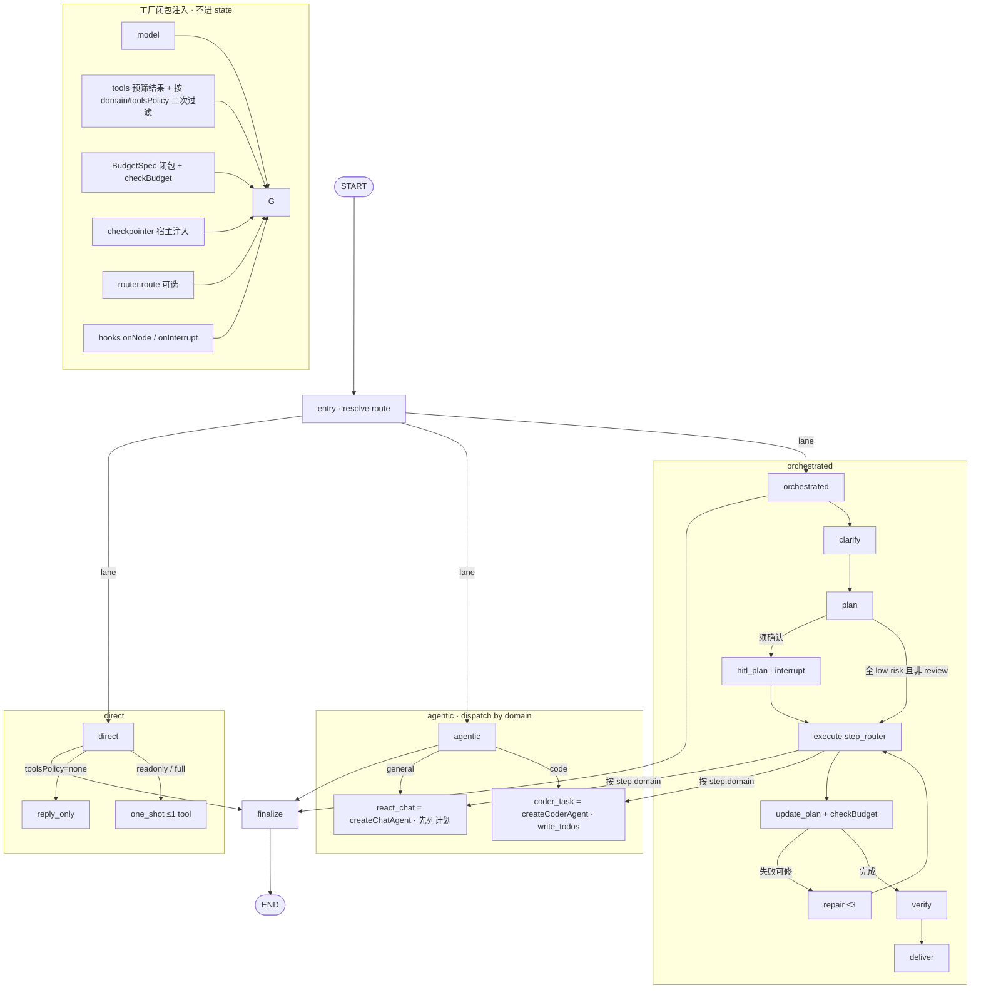

# 会话母图实现方案（落地计划）

- 位置：`packages/chatvein/agents/docs/conversation-graph-implementation.md`
- 状态：**实现方案**（设计以 `conversation-graph-design.md` 为唯一权威，本文只讲怎么落地）
- 适用：Chatvein 桌面单用户 agent（本地 FS 权限、用户在屏幕前、可离线/本地模型）
- 关联：
  - 设计权威：`docs/conversation-graph-design.md`（lane / 节点语义详解见设计 §5，本文不重复）
  - 上游契约：`docs/分层路由与预算决策.md`（`RouterDecision` / `Lane` / `Domain` / `Band` / `BudgetSpec` / `checkBudget`）
  - 实现目录：`src/conversation/`
  - Worker：`src/chat/`（`createChatAgent` → `langchain.createAgent`）、`src/coder/`（`createCoderAgent` → `deepagents.createDeepAgent`）
  - 运行时：`@chatvein/runtime`（`runTurn`）
  - 红线：**优先成熟第三方，不自研循环**；循环与持久化交给 LangGraph / checkpointer
- **API 以代码为准**：图内路由端口为 `createRouterAgent.route`（不是旧名 `analyze`）；设计 §8 若仍写 `analyze` 视为待对齐笔误

---

## 1. 现状盘点（开工基线）

### 1.1 已就绪（可直接复用）

| 能力 | 位置 | 说明 |
| --- | --- | --- |
| **门面（唯一推荐入口）** | `src/agents.ts` `createChatveinAgents` | 一次装配「模型档位 + 分层路由 + 每轮工具筛选 + 会话母图」 |
| 模型档位派生 | `src/model/bundle.ts` `resolveModelBundle` | 一份配置 → `main / fast / strong / filter`；传模型实例则四档共用 |
| 路由全链路 L0→L1→L2→L3 | `src/router/agent.ts` `createRouterAgent` | 输出 `RouterDecision`（含 `budget` / `safety` / `query` / `meta.layerPath`），已含 L3 收口与抬档降级 |
| 工具预筛 | `src/tools-filter/agent.ts` `createToolsFilterAgent` | 弱模挑本轮工具；候选 ≤ `passthroughK` 直通；异常回退全部候选 |
| 预算声明与校验 | `src/router/l0/budget.ts` | `deriveBudget` / `checkBudget` / `DEFAULT_BUDGET_TABLE`（`trivial→4·none`，`simple→12·readonly`，`standard→512·full`（其余∞），`complex→1024·full`（其余∞）） |
| general worker 工厂 | `src/conversation/workers/general/agent.ts` | 计划 → 逐项执行（含工具筛选 / 自检）→ 设计文档；已导出 `extractFinalAssistantText` |
| 领域→worker 分发 | `src/conversation/lanes/agentic/dispatch.ts` | `dispatchAgenticWorker(domain)` 可用 |
| 路由归一化 | `src/conversation/route.ts` | `normalizeRoute` / `routeFromRouterPlan` / `selectConversationLane` 可用 |
| 母图 | `src/conversation/graph.ts` | `entry → {direct \| agentic \| orchestrated} → finalize` 全链路可编译、可 invoke、可 resume |
| 依赖 | `package.json` | `@langchain/langgraph ^1.4.13`、`langchain ^1.5.10`、`deepagents ^1.13.3` |

### 1.2 仍未接线（阶段 C）

| 文件 | 缺口 | 当前降级行为 |
| --- | --- | --- |
| `conversation/lanes/orchestrated/*` | `clarify / plan / hitl / execute / verify / repair` 未接线 | 复用 `agentic` 子图执行，`task.resultSummary` 标注「orchestrated 档尚未接线」 |
| `conversation/workers/code/*` | `coder_task`（`createDeepAgent`）未接线 | `agentic·code` 降级为 general worker 执行，`resultSummary` 标注「code worker 尚未接线」 |

**结论**：依赖已工业化、`direct` 与 `agentic` 已落地，剩 `orchestrated` 编排档与 `code` worker 接线。二者均**降级执行并显式标注**，不会静默出错、也不会抛错。

---

## 2. 目标 / 非目标 / 红线

**目标**

1. `createConversationGraph(options)` 产出**可编译、可 invoke、可 resume** 的 LangGraph 母图。
2. `lane` 决定图形状，`domain` 只决定 worker 与工具集（新增领域 = 加 worker，不加 lane）。
3. 消费 `RouterDecision`（或等价预填），**不在图内重造路由语义**。
4. HITL 为默认能力：破坏性 / 写盘 / 外发走 `interrupt`，不是静默代办。
5. 每一步可单测：黄金集做到「节点可达」级断言。
6. **预算有执行点**：`checkBudget` 在 worker / orchestrated 步进处被调用（对齐 Router 设计 P4）。

**非目标**：审批 UI / IPC / 会话库（归 `app` 与 runtime）；自研 while 工具循环；多租户配额与远程缓存；本包**创建** SqliteSaver（只接受宿主注入）。

**红线自检**

- 循环、持久化、interrupt 一律用 LangGraph 能力，不手写。
- worker 用 `createAgent` / `createDeepAgent`，不复制其内部流水线。
- `orchestrated` 复用已编译的 agentic worker **子图**，禁止复制流水线。
- 没有 `checkBudget` 调用点的 `maxSteps` / `toolsPolicy` 字段等于幻觉。

---

## 3. 目标架构



### 3.1 文件职责与交付

| 文件 | 职责 | 现状 | 本轮交付 |
| --- | --- | --- | --- |
| `state.ts` | 真实 `Annotation.Root`（`messages/route/routeReady/task/finalText`）；纠正 `DEFAULT_ROUTE` | 假对象 + band/maxSteps 不一致 | **阶段 A** |
| `types.ts` | `ConversationRoute` / `TaskState` / … | 齐全 | 补 invoke 结果类型；可选 `BudgetUsage` 运行时计数放闭包不进 Annotation |
| `entry/resolve-route.ts` | route 优先级与 `routeReady` | 空壳 | **阶段 A** |
| `route.ts` | `routeFromRouterPlan(RouterDecision)` | **仍抛错** | **阶段 A**（runtime 预填立刻要用） |
| `graph.ts` | `buildConversationGraph` + `createConversationGraph` | 空壳 | **阶段 A** 起 |
| `finalize.ts` | 节点包裹 + 复用 `chat/agent.extractFinalAssistantText` | 空壳 | **阶段 A** |
| `lanes/agentic/*` | 按 domain 调 general/code worker | 空壳 | **阶段 B** |
| `lanes/orchestrated/*` | clarify/plan/hitl/execute/verify + `checkBudget` | 空壳 | **阶段 C** |
| `workers/direct` | 小工具人 reply_only / one_shot | 已实现 | 阶段 A |
| `workers/general`,`workers/code` | 包工厂 → 节点胶水；**须列计划** | 空壳 | **阶段 B** |
| `prompts.ts` | 内化 persona 全文 | 占位文案 | 与实现同步补齐 |

---

## 4. 状态模型

```ts
// Annotation 通道（checkpoint 友好）
messages   // messagesStateReducer；worker 整表替换时用 Overwrite
route      // ConversationRoute：lane/domain/band/maxSteps/toolsPolicy/query/reason
routeReady // 仅「显式预填」或「entry 写完」后为 true，避免默认 route 吞掉 Router
task       // TaskState：intent/artifacts/plan/repairCount/resultSummary
finalText  // finalize 写入 state，同时作为 invoke 返回值投影（见 §15）
```

**约定**

- `tools` / 完整 `BudgetSpec` / `BudgetUsage` **不进 state**：工厂闭包持有本轮 `deriveBudget(band)` 与可变 usage；策略变更不被旧 checkpoint 绑死。
- `maxSteps` 来自 `budget.maxSteps`，用于 worker `recursionLimit`；**同时**作为 `checkBudget` 的 steps 上限。
- `toolsPolicy` 来自 `budget.toolsPolicy`，决定 `direct` 分叉与工具二次过滤。
- `lane` 管图形状、`band` 管执行约束、`domain` 管 worker —— 三者勿混用。
- `DEFAULT_ROUTE` 落地默认：`lane:'direct', domain:'general', band:'trivial', maxSteps:1, toolsPolicy:'none'`（与 `deriveBudget('trivial')` 一致）。

---

## 5. `entry` 节点：route 优先级

```
1. lockLane / lockDomain（UI 工作模式锁定）
2. 预填 route 且 routeReady === true（runtime 已跑完 Router 后注入）
3. 提供 router port → 调用 router.route(...)，再 routeFromRouterPlan
4. 否则默认 lane='direct', domain='general', band='trivial'
```

写入 `{ route, routeReady: true }`。

**两类「澄清」勿混用**：

| 概念 | 来源 | 行为 |
| --- | --- | --- |
| `RouterDecision.clarification` | Router 判定信息不足 | **本轮不进母图**；app 展示反问，用户补全后重新 `route` |
| `orchestrated/clarify` 节点 | 计划执行前查缺槽位 | **已在图内**；`interrupt` 问用户后同 `thread_id` resume |

`safety.verdict === 'reject'`：runtime 在 invoke 前终止，不进入执行图。

---

## 6. `direct` lane

| 子路径 | 条件 | 实现选型（定稿） |
| --- | --- | --- |
| `reply_only` | `toolsPolicy === 'none'` | 单次 `model.invoke`，无工具 |
| `one_shot` | `readonly` / `full` | **禁止**用 `createAgent` 冒充（易变多步）。做法：`model.bindTools(tools)` → 单次 invoke → 若有 tool_calls **只执行第一个** → 把 ToolMessage 追加后再 **一次** invoke 收束文案。无 tool_calls 则直接收束 |

禁止多步工具链（那属于 `agentic`）；桌面默认在无明确只读需求时 `toolsPolicy='none'`。

---

## 7. `agentic` lane：按 domain 选 worker

复用现成 `dispatchAgenticWorker(domain)`（仅 general | code；历史 office → general）：

| domain | worker | 实现来源 | 约束 |
| --- | --- | --- | --- |
| `general` | `react_chat` | `createChatAgent`（`createAgent`） | **先列短计划再执行**；`recursionLimit ≈ maxSteps`；步进处 `checkBudget` |
| `code` | `coder_task` | `createCoderAgent`（`createDeepAgent`） | **write_todos 先计划**；`recursionLimit` 对齐更高档；`backend` 锁会话工作区 |

worker 节点统一签名 `(state) => Partial<ConversationState>`，内部只做「取 `route` + 调工厂 + 回写 `messages`」，不复制循环。

**工具二次过滤**：runtime C1/C2 预筛后注入候选全集；工厂在调用某 worker 前按**当前** `domain` + `toolsPolicy` 再切一刀（或接受可选 `toolsByDomain`）。

---

## 8. `orchestrated` lane

| 节点 | 职责 |
| --- | --- |
| `clarify` | 对照 `query.slots` / `query.intents` 查缺；缺则 `interrupt`（图内澄清，≠ Router clarification） |
| `plan` | LLM → `PlanStep[]`（可消费 `intents`），标注 `risk` 与 `domain` |
| `hitl_plan` | `interrupt` 展示/改计划 → 同 `thread_id` resume |
| `execute` | `step_router` 按 `step.domain` 调**已编译 worker 子图**（工具按该 step.domain 过滤） |
| `update_plan` | 更新 step 状态、累积 `task.artifacts`、记录失败；**调用 `checkBudget`** |
| `repair` | 默认上限 **`repairCount < 3`**；超出则 `interrupt` 交用户 |
| `verify` / `deliver` | 清单校验 + 最终汇报 → `task.resultSummary` |

**HITL 何时必经 / 可跳过（定稿）**

- **必经 `hitl_plan`（或步进 HITL）**：`safety.verdict === 'review'`；或计划中存在任一 `risk: high`；或写盘 / 外发步骤。
- **可跳过计划级 HITL**：全部 step 为 `risk: low` 且非 `review`、无写盘外发 —— 仍允许执行前对单个 high-risk step 做步进确认。

其余：无依赖 `PlanStep` 可扇出并行，有依赖则串行；母图**不二次降档** Router 已抬的 lane。

---

## 9. Worker 角色（定稿）

| worker | 目录 | 职责 |
| --- | --- | --- |
| `direct` | `workers/direct` | 小工具人：0～1 工具，不列长计划 |
| `general` | `workers/general` | 通用能力（含原 office 文档任务）；**须先列计划再做事** |
| `code` | `workers/code` | 编码能力；**write_todos 强制先计划** |

不再单独维护 `office` domain / worker；`#office` 文内指令映射为 `agentic·general`。

---

## 10. 预算执行点（`checkBudget`）

对齐 Router 设计：**没有执行点的预算维度等于幻觉。**

| 位置 | 检什么 | 耗尽时 |
| --- | --- | --- |
| `agentic` worker 每步回调 / 循环后 | `steps` / `toolCalls`；能拿到则检 `inputTokens`/`outputTokens`；`elapsedMs` 相对本轮起点 | `onExhausted==='ask'` → `interrupt`；`'stop'` → 写 `task.resultSummary` 后进 `finalize` |
| `orchestrated` 的 `update_plan` 之后 | 同上（跨 step 累计 usage） | 同上 |
| `direct/one_shot` | 工具执行前后把 `toolCalls` 计 0/1；通常不会触顶 | 触顶则直接 finalize |

闭包持有本轮：

```ts
const budget = deriveBudget(route.band, budgetPolicy)
const usage: BudgetUsage = { ...EMPTY_USAGE, /* elapsed 用 Date.now()-t0 */ }
// 每步：checkBudget(budget, usage)
```

`BudgetSpec` 本身不进 Annotation；`route.maxSteps` / `route.toolsPolicy` 只是投影快照，便于节点只读。

---

## 11. 工厂契约

```ts
interface CreateConversationGraphOptions {
  model: LanguageModelLike
  /** runtime C1/C2 预筛后的候选；工厂内再按 domain + toolsPolicy 过滤 */
  tools?: StructuredToolInterface[]
  /** 可选：按领域预切好的工具表（优先于对 tools 的二次过滤） */
  toolsByDomain?: Partial<Record<Domain, StructuredToolInterface[]>>
  middleware?: AnyAgentMiddleware[]
  /** 宿主注入；本包不创建 SqliteSaver */
  checkpointer?: BaseCheckpointSaver
  coder?: { backend?: CreateDeepAgentParams['backend']; permissions?: FilesystemPermission[] }
  lockLane?: Lane
  lockDomain?: Domain
  /** 未预填 route 时可选：须为 createRouterAgent.route 形态 */
  router?: { route(input: RouterInput): Promise<RouterDecision> }
  budgetPolicy?: BudgetPolicy
  /** 与 RouterInput.signal 对齐，贯通 worker invoke */
  signal?: AbortSignal
  hooks?: {
    onNode?: (name: string, state: ConversationState) => void
    onInterrupt?: (payload: unknown) => void
  }
  name?: string
}

interface ConversationInvokeInput {
  messages?: BaseMessage[]
  input?: string
  route?: ConversationRoute
  routeReady?: boolean
  thread_id: string
  signal?: AbortSignal
}

interface ConversationGraph {
  graph: CompiledStateGraph
  invoke(
    input: ConversationInvokeInput,
    config?: RunnableConfig,
  ): Promise<{
    finalText: string
    task: TaskState
    route: ConversationRoute
    messages: BaseMessage[]
  }>
  /** 阶段 B+：供桌面 thinking / 增量 UI；阶段 A 可不实现 */
  stream?(
    input: ConversationInvokeInput,
    config?: RunnableConfig,
  ): AsyncIterable<unknown>
}
```

`createChatAgent` / `createCoderAgent` 继续作为 **worker 级** API 保留；产品主路径走母图。

---

## 12. 与 Router / Runtime 的衔接

```
runTurn:
  （可选）C1/C2 工具预筛 —— 留在 runtime
  → createRouterAgent.route(...) → RouterDecision
  → reject：终止；仅 clarification：app 先展示反问，不 invoke 母图
  → createConversationGraph({ model, tools, checkpointer, signal, hooks, ... })
       // checkpointer / SqliteSaver 由 runtime 或 app 创建后注入
  → graph.invoke({
       messages,
       route: routeFromRouterPlan(decision),
       routeReady: true,
       thread_id,
       signal,
     })
```

投影（**阶段 A** 落地到 `conversation/route.ts`）：

```ts
function routeFromRouterPlan(d: RouterDecision): ConversationRoute {
  return {
    lane: d.lane,
    domain: d.domain,
    band: d.band,
    maxSteps: d.budget.maxSteps,
    toolsPolicy: d.budget.toolsPolicy,
    query: d.query,
    reason: d.reason,
  }
}
```

| Router 信号 | 母图行为 |
| --- | --- |
| 寒暄 / 单点问答 | `direct` · `general` |
| 短工具链 / 单点改 bug | `agentic` · 对应 domain |
| 多产物 / 要计划审批 / 多文件重构 | `orchestrated` · 对应 domain |
| 灰区 | Router 已抬档；母图**不二次降档** |
| `safety: review` | `orchestrated` + HITL |
| `safety: reject` | 不进入母图 |
| `clarification` 已给出 | 本轮不进执行图，用户补全后重新路由 |

Checkpointer：**宿主注入** `SqliteSaver`（或等价）+ `thread_id`；`interrupt` → app hooks 弹确认/改计划 → 同 `thread_id` resume。agents 包不负责打开 DB。

---

## 13. 实施阶段与验收

| 阶段 | 内容 | 验收 |
| --- | --- | --- |
| **A · 最小可跑图** | 真实 `Annotation.Root` + 纠正 `DEFAULT_ROUTE`；`routeFromRouterPlan`；`entryNode`；`direct`（`reply_only` / `one_shot` 按 §6）；`finalize`（复用 `extractFinalAssistantText`）；`createConversationGraph` 编译 + **invoke**（stream 可暂缓） | ✅ 「闭包是什么」→ `direct·general` 出 `finalText`；无 router 时默认 `direct·general·trivial`；预填 `routeReady` 路径可用 |
| **A+ · 门面内置** | `createChatveinAgents` 一次装配；模型档位派生（`main/fast/strong/filter`）；内置路由 + 每轮工具筛选；主入口收敛 | ✅ 只给 `model` 即可跑通；`router: false` / `toolsFilter: false` 可关闭 |
| **B · agentic + runtime 薄切** | `createAgenticLane` + `react_chat` + `coder_task`；`recursionLimit`/`checkBudget`；工具二次过滤；**`runTurn` 改为母图 invoke**（去掉临时 `pickExecutor` chat/coder 双轨）；可选挂上 `stream` | 🟡 `agentic·general` 已接线（`createChatAgent`）；`coder_task`（`createDeepAgent`）**未接线**，降级为 general worker 并标注；runtime 侧接入待做 |
| **C · orchestrated 档** | `clarify / plan / hitl_plan / execute / update_plan / repair(≤3) / verify / deliver`；子图复用；HITL 规则见 §8 | 「重构 utils…」→ plan→coder×N→verify；`risk:high` / `review` 可 resume |
| **D · 契约打磨** | prompts 内化补全；设计 §7 黄金集全绿；streaming / hooks 与 thinking panel 联调 | L3 抬档结果被母图正确消费；预算耗尽路径有单测 |

**每阶段收口**：`tsc --noEmit` + `vitest run` 全绿，不新增依赖。

---

## 14. 测试策略

1. **图级可达性**（对齐设计 §7）：脚本化模型断言关键节点被走过，而非只断言最终文本。
2. **route 优先级**：lock > 预填 `routeReady` > `router.route` > 默认档，四条各一例。
3. **HITL resume**：`interrupt` 后同 `thread_id` 恢复，断言 `task.plan` 被修改且继续执行。
4. **降级路径**：无 router → 默认 `direct·general·trivial`。
5. **安全衔接**：`reject` 不进图、`review` 必走 HITL。
6. **预算**：mock 把 `maxSteps`/`maxToolCalls` 压到极小，断言 `ask`→interrupt 或 `stop`→finalize。
7. **one_shot**：模型返回 2 个 tool_calls 时只执行第一个，且总模型调用次数 ≤ 2。

测试不依赖真实网络；模型一律 mock。

---

## 15. 已拍板结论（原开放问题）

| # | 结论 |
| --- | --- |
| Domain | **仅 `general` \| `code`**；原 office 并入 general（见 §9） |
| streaming | **阶段 A 仅 `invoke`**；**阶段 B+** 增加 `stream` / `astreamEvents` 包装供桌面 UI |
| 工具装配 | **runtime C1/C2 预筛 + 工厂按 domain/`toolsPolicy` 二次过滤**（可选用 `toolsByDomain`）；母图不设 `prepare_tools` 节点 |
| `finalText` | **写入 state**（与设计 Annotation 一致），`invoke` 再投影返回 |

---

## 16. 风险与红线检查清单

| 风险 | 对策 |
| --- | --- |
| 把预算/工具塞进 state，被旧 checkpoint 绑死 | 闭包注入；state 只存 `route/task/messages/finalText` |
| 声明了 budget 却从不 `checkBudget` | §10 强制执行点；阶段 B/C 单测 |
| `orchestrated` 复制 agentic 流水线 | 强制 `addNode` 复用已编译 worker 子图 |
| `one_shot` 误用 `createAgent` | §6 定稿：bindTools + 至多 1 次工具 |
| 自研工具循环 | 一律 `createAgent` / `createDeepAgent` / LangGraph 边 |
| `messages` 被 worker 整表替换丢历史 | 明确 `Overwrite` 语义与合并策略，单测覆盖 |
| domain 膨胀 | 只保留 general/code 两角色；文档任务归 general |
| `extractFinalAssistantText` 重复实现 | conversation 侧直接复用 `chat/agent` |
| 本包自建 SqliteSaver | 宿主注入；agents 只消费 `checkpointer?` |
| `tier` / 旧目录名回流 | 统一 `lane` / `band` |
| `DEFAULT_ROUTE` 与预算表不一致 | 阶段 A 纠正 |

---

## 17. 索引

| 产物 | 路径 |
| --- | --- |
| 设计（权威） | `docs/conversation-graph-design.md` |
| 本文（实现方案） | `docs/conversation-graph-implementation.md` |
| 实现 | `src/conversation/`（`graph` / `entry` / `lanes/*` / `workers/*`） |
| Router 设计 | `docs/分层路由与预算决策.md` |
| Coder 设计 | `docs/coder-agent-design.md` |
| 单测 | `src/conversation/__tests__/` |
