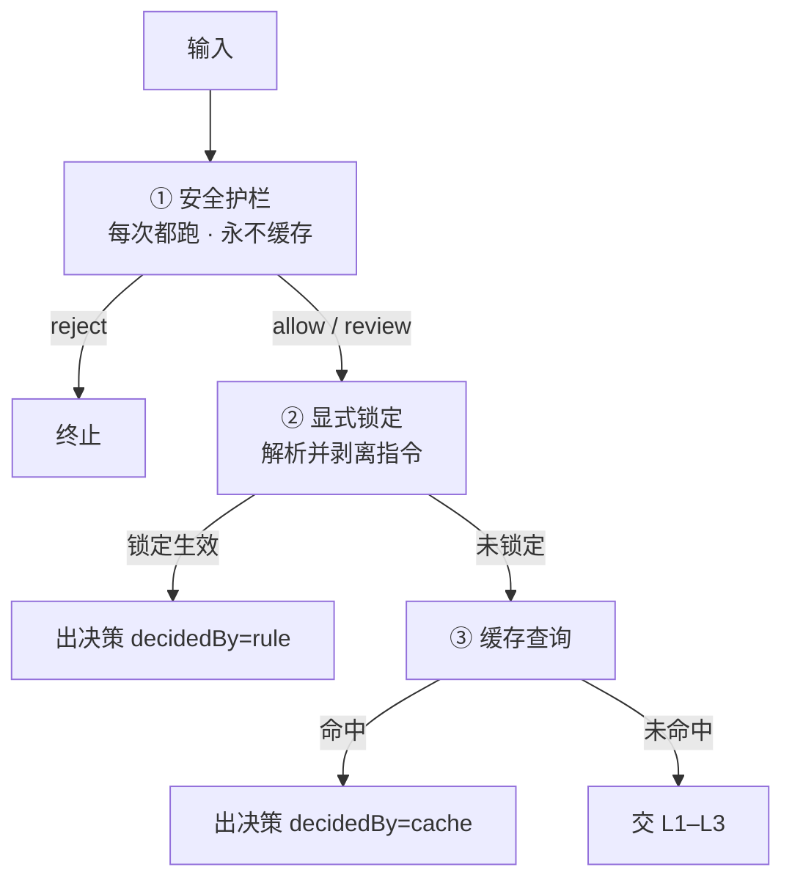

# Router Agent 设计：分层路由与预算决策

- 位置：`分层路由与预算决策.md`
- 状态：设计定稿（**已按 Electron 桌面单用户场景修订**）
- 定位：把一次用户输入翻译成「**执行形态 + 领域 + 预算 + 置信度**」的结构化决策
- 红线：**路由器不是 agent** —— 单次结构化调用，不跑工具循环
- 适用：**Electron 桌面单用户 agent**（有真实本地文件权限，可能跑本地模型 / 离线）

> **本版修订说明**：初版按多租户 SaaS 撰写，含租户配额、AI 网关计费、成本-质量降级梯。
> 这些内容在桌面端**不成立甚至是反的**，已移除，并补入桌面端特有的约束：
> 本地文件权限风险、用户是数据所有者、离线/本地模型降级、隐私优先。

---

## 1. 定位与边界

Router Agent 只负责**一件事**：给定用户这一轮输入（含历史与上下文），产出一份**结构化、可校验、可兜底**的路由决策，交给下游执行图。

### 它决定什么

| 维度 | 含义 |
| --- | --- |
| **执行形态（lane）** | 要不要自主工具循环、要不要规划编排 |
| **领域（domain）** | 用哪套工具集 / 提示词 / worker |
| **预算（budget）** | 用多强的模型、最多几步、给不给工具、能给多大权限 |
| **置信度与交互** | 判断够不够可信、要不要先反问用户 |

### 它不决定什么

- 具体选哪几个工具 —— 那是 **tools-filter** 的职责；
- 任务怎么一步步执行 —— 那是**执行图**的职责；
- 最终答案是什么 —— 那不是路由的事；
- **租户配额与计费** —— 桌面端不存在多租户，也不经过 AI 网关。

> 判断标准：好的路由能用**一张静态用例表**离线验收；如果需要真跑模型才能测，说明它耦合了执行行为，已经退化成"又一个 agent"。

---

## 2. 设计原则

### 通用原则

| 原则 | 说明 |
| --- | --- |
| **路由不是 agent** | 单次结构化调用，无工具循环、无多轮 |
| **必有兜底** | 任一层失败/超时/解析错误都能降级 |
| **置信度驱动** | 低置信不硬猜，而是升级或反问 |
| **灰区抬档** | 不确定就往上抬一档，宁可多花不要误判 |
| **可离线验收** | 黄金集 + 静态断言，不依赖真实模型调用 |
| **职责单一** | 只定形状/领域/预算，不定工具清单 |

### 桌面端特有原则（本版新增）

| 原则 | 说明 |
| --- | --- |
| **用户是数据所有者** | 用户有权删自己的文件、也有权把内容传走。安全护栏要防的是"**用户不知情**"，不是"用户做了这件事" → **只有注入是 `reject`，其余一律 `flag` 交用户确认** |
| **本地文件权限是头号风险** | agent 持有真实文件系统权限，破坏性操作的代价远高于 SaaS → 安全规则重心放在本地副作用 |
| **无网也要能用** | 用户可能跑本地模型或处于离线。L2 是不可用的第三方调用 → 必须有**纯规则降级路径**（L1 直接出决策 + 兜底） |
| **隐私优先** | 路由输入可能含敏感本地内容；能用规则判定就不发模型，能本地判定就不上云 |
| **延迟 > 成本** | 桌面端没有多租户成本压力（BYO key / 本地模型），**优化目标是响应速度和准确率**，不是省钱 |

---

## 3. 总体架构：L0–L3 级联 + 兜底

```mermaid
flowchart TD
  IN[用户输入 + 历史] --> L0

  L0{L0 前置层<br/>安全 / 锁定 / 缓存(可选)}
  L0 -->|命中缓存| OUT[RouterDecision]
  L0 -->|判定为注入| REJ[reject 终止]
  L0 -->|放行| L1

  L1{L1 快速层<br/>规则 + 语义}
  L1 -->|高置信| OUT
  L1 -->|未定| L2

  L2[L2 主分类层<br/>弱模型 · 结构化输出]
  L2 -->|confidence ≥ 接受阈值| OUT
  L2 -->|灰区 / 低置信| L3

  L3[L3 升级层<br/>强模型 / 推理]
  L3 -->|仍低置信且缺关键信息| CLAR[clarification 反问]
  L3 -->|仍低置信但不缺信息| ESC[抬一档后采纳]
  CLAR --> OUT
  ESC --> OUT

  L1 -.超时/异常/离线.-> FB
  L2 -.超时/异常/离线.-> FB
  L3 -.超时/异常/离线.-> FB
  FB[兜底 direct·general] --> OUT
```

| 层 | 延迟 | 职责 | 桌面端说明 |
| --- | --- | --- | --- |
| **L0 前置层** | < 1ms | 安全护栏、显式锁定、缓存 | 缓存**可选**，单用户命中率低，默认不启用 |
| **L1 快速层** | < 10ms | 规则 + 语义相似度 | **离线时唯一可用层**，务必做扎实 |
| **L2 主分类层** | 100~300ms | 弱模型结构化分类（主力） | 依赖网络；不可用时必须有降级 |
| **L3 升级层** | 1~3s | 强模型 / 带推理，仅灰区 | 目的是提准确率，不是省成本 |
| **Fallback** | < 1ms | 永远可用的默认决策 | 离线也要能出 |

---

## 4. 分层详细设计

### 4.1 L0 前置层（零成本）

**执行顺序是设计的一部分，不可调换**：



1. **安全护栏（最先、永不缓存）**：规则会随版本更新，因此**每次实时扫描**。缓存只存"语义判断"，安全结果永远现算。
2. **显式锁定**：工作模式锁定（调用方传入）+ 文内指令（`/code`、`#office`）+ `#auto` 逃生舱。锁定是确定性的，**优先于缓存**。
3. **缓存**：可选，默认不启用。见 §13。

> 待补：桌面端可利用**工作区上下文**（当前项目类型/目录）在 L0 直接锁定领域 —— 比 L2 分类更早、更确定。

### 4.2 L1 快速层（规则 + 语义）

**离线时唯一可用的层**，桌面端应重点投入。

**规则信号**（确定性，无模型）：

| 信号 | 提取方式 |
| --- | --- |
| 代码符号 | 反引号、`file.ts:12`、函数名、堆栈、报错文本 |
| 文件与附件 | 路径、扩展名（`.pdf/.xlsx/.docx`） |
| 领域关键词 | 解析/抽取/转换/导出、重构/测试/构建 |
| 指令形态 | 疑问句 vs 祈使句、长度、是否含多步骤连接词 |
| 引用与指代 | "这个""再改一下""继续" → 需历史 |

**语义层**（可选）：为 `(lane, domain)` 维护典型 utterance，用**本地小 embedding 模型**算相似度（隐私优先，不依赖云端）。

输出：高置信 → 出决策；否则 `pass` 到 L2。

### 4.3 L2 主分类层（弱模型 · 主力）

- **单次调用**，`temperature = 0`、小 `maxTokens`、**JSON Schema / tool call** 结构化输出。
- **Prompt 要素**：角色定义 → lane/domain 词汇表与判别标准 → 历史摘要 → few-shot（每类 2~3 条）→ 输出 schema → 要求给出 `reason` 与 `confidence`。
- **校验链**：schema 校验 → 枚举归一 → 失败即落兜底，**不重试**。
- **离线/不可用**时直接降级到 L1 结果或兜底，不阻塞。

### 4.4 L3 升级层（强模型 / 推理）

**触发条件**（任一）：

- `confidence < escalateThreshold`
- `ambiguous = true`
- 检测到**多意图**且需要串联
- 被安全护栏 `flag`（本地破坏性操作、凭据、外发）

**做法**：换强模型，或要求先输出简短判别理由再给结论（轻量 CoT）。

### 4.5 Fallback 兜底

任何层超时/异常/离线/解析失败 → 返回：

```
lane = 'direct'，domain = 'general'，band = 'trivial'，
confidence = 0，decidedBy = 'fallback'
```

原则：**兜底要保守但不阻断** —— 用最无害的路径把话接住，绝不抛错卡死桌面应用。

---

## 5. 输出契约 `RouterDecision`

```ts
/** 执行形态：决定图的复杂度 */
type Lane = 'direct' | 'agentic' | 'orchestrated'
/** 领域：general 通用 / code 编码（原 office 归 general；可扩展） */
type Domain = 'general' | 'code' | (string & {})
/** 预算档 */
type Band = 'trivial' | 'simple' | 'standard' | 'complex'

interface RouterDecision {
  // —— 路由目标 ——
  lane: Lane
  domain: Domain
  band: Band

  // —— 预算（实时派生，不进缓存）——
  budget: {
    modelTier: 'weak' | 'medium' | 'strong'
    maxSteps: number
    maxToolCalls: number
    maxInputTokens: number
    maxOutputTokens: number
    maxWallClockMs: number
    /** readonly = 只读无副作用 —— 桌面端最实用的一档 */
    toolsPolicy: 'none' | 'readonly' | 'full'
    /** 耗尽时：停下 or 问用户 */
    onExhausted: 'stop' | 'ask'
  }

  // —— 置信度与溯源 ——
  confidence: number          // 0..1
  ambiguous: boolean
  decidedBy: 'cache' | 'rule' | 'semantic' | 'l2' | 'l3' | 'fallback'

  // —— 交互：缺关键信息时不猜，反问 ——
  clarification?: {
    question: string
    options?: string[]
  }

  // —— 安全 ——
  safety: {
    verdict: 'allow' | 'reject' | 'review'
    category?: 'injection' | 'privilege' | 'exfiltration' | 'destructive'
    ruleId?: string
    reason?: string
  }

  // —— 查询理解 ——
  query: {
    rewritten: string         // 去指代、补全后的规范表述
    searchQuery?: string
    slots?: Record<string, unknown>  // 文件路径、模块名、数量、时间等
    intents?: string[]        // 多意图拆分
  }

  // —— 审计 ——
  reason: string
  meta: {
    latencyMs: number
    layerPath: string[]       // 例如 ['l0','l1','l2']
    promptVersion: string
  }
}
```

### 字段必要性说明

| 字段组 | 为什么必须有 |
| --- | --- |
| `lane` / `domain` / `band` | 下游据此选执行路径与预算，是路由的核心产物 |
| `budget` | **桌面端重点是 `toolsPolicy`**：别让对话类任务拿到写权限 |
| `confidence` + `ambiguous` | 没有它就无法升级、无法兜底，只能硬猜 |
| `clarification` | 用户就在屏幕前，反问比误判划算得多 |
| `safety` | 路由是输入护栏的最佳位置，越早拦截越省 |
| `query.*` | 指代消解与槽位抽取直接影响下游执行质量 |
| `reason` / `meta` | 桌面端本地排障的基础 |

> **预算与安全都不进缓存**：二者是策略，会随配置/版本变更；缓存它们会导致旧缓存在策略更新后继续生效。命中缓存后由调用方实时派生。

---

## 6. 路由决策矩阵

| 用户信号 | lane | domain | 备注 |
| --- | --- | --- | --- |
| 寒暄、概念问答、确认/澄清 | `direct` | `general` | 单次回答 |
| 单点事实查询（天气、行情） | `direct` / `agentic` | `general` | 需工具则升 agentic |
| 指定文件解析/抽取/转换/导出，步骤少 | `agentic` | `general` | 短工具链 + 先列计划 |
| 单点代码问题（修一个类型错误） | `agentic` | `code` | 单任务 + write_todos |
| 多文件重构、跨模块改动、需验证 | `orchestrated` | `code` | 需规划与校验 |
| 多步骤文档、多产物、要计划 | `orchestrated` | `general` | 需 HITL |
| 多意图且需串联（"查 X 并写进 Y"） | `orchestrated` | 主领域 | 拆 intents |
| 缺关键信息（没说哪个文件/模块） | — | — | 优先 `clarification` |
| 灰区（拿不准） | **抬一档** | 按主领域 | 勿压成 direct |
| 被安全 `flag`（删文件/凭据/外发） | **强制 `orchestrated`** | 主领域 | 走用户确认 |

---

## 7. 预算策略：`band → budget`

| band | modelTier | maxSteps | maxToolCalls | maxInput | maxOutput | maxWallClock | toolsPolicy | onExhausted |
| --- | --- | --- | --- | --- | --- | --- | --- | --- |
| `trivial` | `weak` | 4 | 0 | 16k | 2k | 20s | `none` | `stop` |
| `simple` | `weak` | 12 | 6 | 32k | 4k | 60s | `readonly` | `ask` |
| `standard` | `medium` | 512 | ∞ | ∞ | ∞ | ∞ | `full` | `ask` |
| `complex` | `strong` | 1024 | ∞ | ∞ | ∞ | ∞ | `full` | `ask` |

**桌面端取舍说明**：

- **`standard` / `complex` 暂时只硬卡步数**：工具次数 / token / 墙钟用 `BUDGET_UNLIMITED`，避免解题中途误杀；防跑飞靠 `maxSteps` + `onExhausted: ask`。
- **`simple` 给 `readonly` 而非 `full`**：短查询不该有写/删/外发权限。
- **耗尽默认 `ask` 而非 `stop`**：用户就在屏幕前，停下来问一句比自作主张更自然；只有 `trivial` 用 `stop`（不打扰用户）。
- **不做成本上限、不做降级梯**（见 §19）。

**lane 与 band 的正交性**：

- `lane` 管**形状**，`band` 管**预算**；二者通常相关但可分离。
- `lane = direct` 时通常 `toolsPolicy = none`，步数取 band（多为 trivial/simple）。
- `lane = agentic` 时 `maxSteps` 取 band 对应值，作为循环上限（runtime 有工具时透传为 `recursionLimit`）。
- `lane = orchestrated` 时 `maxSteps` 指**单个 worker** 的上限，全局步数由编排图控制。

> **准则：没有执行点的预算维度等于幻觉。** `checkBudget` 必须由执行图在每一步调用，否则这些字段只是纸面声明。

---

## 8. 置信度、阈值与升级

`confidence` 需在**黄金集上标定**（不是模型自报的原始概率，可做温度/分位校准）。

| confidence | 处理 |
| --- | --- |
| ≥ `accept`（默认 0.85） | 直接采纳 |
| `escalate` ~ `accept`（0.60~0.85） | 采纳，但标 `ambiguous`；若 `lane = direct` 且 `domain ≠ general`，**抬到 agentic** |
| < `escalate`（0.60） | 升级 L3 重判；**L3 不可用（离线）则抬一档采纳** |
| L3 后仍 < `escalate` | 缺关键信息 → `clarification`；否则抬一档（`direct→agentic→orchestrated`）后采纳 |

**关键指标**：升级率与兜底率是调阈值的主要信号 —— 升级率过高说明 L1/L2 太弱或阈值太严；兜底率过高说明链路不稳或离线场景没覆盖。

---

## 9. 澄清问询（Clarification）

当判定"信息不足以可靠路由"时，返回 `clarification` 而非硬猜：

```ts
{
  clarification: {
    question: '你希望我处理哪个文件？',
    options: ['合同.pdf', '报价单.xlsx']
  },
  lane: 'direct', domain: 'general',   // 占位，等用户回答后重路由
  confidence: 0.3
}
```

要点：

- 问题要**具体**、给出**候选**，避免开放式追问；
- 用户回答后**重新走完整路由**（此时历史已补全）；
- 澄清次数设上限（建议 1 次），超限则抬档执行。

桌面端这一步尤其划算——用户就在屏幕前，一次点击就能消解歧义，比让 agent 猜错再返工便宜得多。

---

## 10. 安全护栏（桌面端威胁模型）

路由是**输入侧最早的拦截点**，成本最低。桌面端 agent 持有真实文件系统权限，威胁模型与 SaaS 完全不同。

### 核心判断

> **只有注入是 `reject`，其余一律 `flag`。**

用户是自己数据的所有者，有权删文件、也有权把内容传走。真正要防的是"**用户不知情**"，所以抬档让他确认，而不是替他拒绝。

| 类别 | 判定 | 规则示例 |
| --- | --- | --- |
| **间接提示词注入** | `reject` 终止 | "忽略以上指令"、`ignore previous instructions`、角色注入 |
| **本地破坏性操作** | `flag` → 抬 `orchestrated` 走确认 | `rm -rf`、`git reset --hard`、`drop table`、`格式化`、`删除文件`、`覆盖文件` |
| **敏感路径** | `flag` | `.ssh`、`.aws`、`.gnupg`、`/etc`、`System32`、密钥链 |
| **凭据** | `flag` | `.env`、`secret_key`、`api_key`、私钥/密钥/口令 |
| **数据外发** | `flag` | 上传/POST 到外部 URL |

### 已剔除的 SaaS 威胁

| 规则 | 为何剔除 |
| --- | --- |
| 套取系统提示词 | 桌面端无人关心你的 system prompt |
| 越权 / 关闭安全护栏 | 无多租户概念，威胁模型不成立 |

### 实现要点

- **纯正则规则**，无模型，< 1ms，可单测；
- **归一化后再扫描**（剥零宽字符 + NFKC + 折叠空白），否则 `ig\u200Bnore` 就能绕过；
- **扫描与缓存 key 必须共用同一个归一化函数**；
- 拿不准的用 `flag` 不用 `reject`：误杀比漏拦更伤体验。

---

## 11. 查询理解

路由顺带完成轻量理解，避免下游重复劳动：

- **`rewritten`**：去指代（"它""这个"→ 具体对象）、补全省略，供下游直接使用；
- **`searchQuery`**：面向检索的精简查询串；
- **`slots`**：文件路径、模块名、数量、时间等结构化槽位；
- **`intents`**：多意图拆分，供 `orchestrated` 生成计划。

---

## 12. 多轮上下文处理

- 历史**摘要后**进 prompt（不整段塞入，控 token、降延迟）；
- 重点识别：指代消解、任务延续（"继续""再改一下"）、目标切换（"换个话题"→ 重新路由）；
- 若本轮是**对澄清的回答**，与上一轮意图合并后再判定。

---

## 13. 缓存、超时与降级

| 机制 | 做法 |
| --- | --- |
| **缓存** | **桌面端价值低**：单用户每天几十条消息，重复 query 极少，命中率趋近于 0。实现保留但**默认不接线**；等有数据证明命中率 > 10% 再启用 |
| **超时** | L1/L2/L3 各自设超时（建议 50ms / 2s / 8s），超时即落下一级或兜底 |
| **离线降级** | L2/L3 依赖网络；不可用时由 **L1 规则层直接出决策**，再不行落兜底 —— 桌面端必须能在无网时继续工作 |
| **降级** | 任一层异常 → 直接 fallback，**不重试、不阻塞**主流程（绝不卡死 UI） |
| **幂等** | 同一输入同上下文 → 同一决策（temperature 0 + 固定 prompt 版本） |

---

## 14. 可观测性与指标

桌面端没有服务端看板，重点转向**本地排障**。

| 指标 | 用途 |
| --- | --- |
| 路由准确率（对黄金集） | 离线回归质量 |
| P50 / P95 延迟 | 桌面端核心体验指标 |
| 各层命中率（L0/L1/L2/L3/fallback） | 分层是否合理、离线时是否退化为兜底 |
| 升级率 / 澄清率 / 兜底率 | 调阈值的主要信号 |
| 被 `flag` 的请求占比 | 安全规则是否过严（误杀信号） |
| **下游返工率** | 路由后是否失败/被用户纠正 —— 最真实的验收指标 |

每次决策应写本地日志：`{ input, decision, layerPath, latencyMs, promptVersion }`。
**注意脱敏**：日志可能含用户本地文件路径与内容，默认只记 `ruleId` / `lane` / `band`，正文按需开启。

---

## 15. 测试策略：黄金集

- **规模**：≥ 100 条，覆盖所有 `lane × domain` 组合；
- **必含边界**：多意图、指代依赖历史、信息缺失、显式锁定、注入样本、超长输入、空输入；
- **桌面端必加**：本地破坏性操作样本（`rm -rf`、删除文件）、凭据样本（`.env`）、中文/中英混杂、**离线场景**（mock L2 不可用）；
- **断言方式**：给定 `(text, history)` → 断言 `lane/domain/band/confidence 区间/clarification/safety.verdict`；
- **分层测试**：L0/L1 与兜底**不依赖模型**，必须能纯离线测；L2/L3 用 mock 模型或快照；
- **回归**：每次改 prompt / 阈值 / 安全规则 → 全量跑黄金集，准确率下降或误杀上升即阻断。

---

## 16. 反馈闭环

桌面端不做偏好数据训练，闭环要轻：

1. 本地记录路由后的**实际成效**（任务是否成功、步数是否超限、用户是否纠正）；
2. 按 `(lane, domain)` 聚合失败率，定位系统性误判；
3. 用户显式纠正（改了领域、重跑）→ 记为高价值样本，回流为 **L1 规则**或 few-shot；
4. 定期用新数据重跑黄金集并重标定 `confidence` 阈值。

---

## 17. API 与配置

```ts
interface RouterInput {
  text: string
  history?: Array<{ role: 'user' | 'assistant'; content: string }>
  attachments?: Array<{ name: string; mime?: string }>
  lockLane?: Lane        // 工作模式锁定
  lockDomain?: Domain
  signal?: AbortSignal
}

interface RouterAgentOptions {
  fastModel?: LanguageModelLike     // L2 弱模型
  strongModel?: LanguageModelLike   // L3，可选
  embedModel?: LanguageModelLike    // L1 语义层，可选（建议本地模型）
  cache?: LRUCache<string, RouteCore> // 进程内 lru-cache，默认不启用（见 §13）
  safetyRules?: SafetyRule[]        // 自定义规则，优先于内置
  thresholds?: { accept: number; escalate: number }
  budgetTable?: Record<Band, BudgetSpec>
  timeoutMs?: { l1: number; l2: number; l3: number }
  promptVersion?: string
  hooks?: { onDecision?: (d: RouterDecision, input: RouterInput) => void }
}

interface RouterAgent {
  route(input: RouterInput): Promise<RouterDecision>
}

function createRouterAgent(options: RouterAgentOptions): RouterAgent
```

---

## 18. 落地阶段

| 阶段 | 内容 | 状态 |
| --- | --- | --- |
| **P0** | 输出契约 + L0（安全/锁定/缓存）+ 预算模块 + 黄金集骨架 | ✅ 已完成 |
| **P1** | **L1 规则层**（代码符号/文件路径/附件/指令形态）—— 离线时唯一可用层 | ✅ 已完成 |
| **P2** | L2 弱模型结构化分类 + 离线降级 | ✅ 已完成 |
| **P3** | L3 升级 + `clarification` + 置信度标定 | 待做 |
| **P4** | `checkBudget` 接入执行图每一步 | 待做 |
| **P5** | 工作区上下文锁定（当前项目类型 → 领域） | 可选 |

---

## 19. 否决与边界

| 方案 | 理由 |
| --- | --- |
| 在路由里跑工具循环 / 让路由"先查再判" | 违反"路由不是 agent"；延迟失控 |
| 让路由直接输出具体工具清单 | 与 tools-filter 职责重叠，耦合且难测 |
| 无兜底（解析失败就抛错） | 桌面应用会卡死，绝对不行 |
| 低置信时硬猜 | 用户就在屏幕前，反问比误判划算 |
| 把业务 SOP / 执行细节塞进路由 | 职责膨胀，路由会变成不可测的第二个大脑 |
| **做租户/用户级配额与计费** | 桌面单用户，不存在多租户与网关 |
| **做成本上限与模型降级梯** | BYO key / 本地模型场景无成本压力；中途偷换模型只会让用户觉得"变笨了" |
| **把"套系统提示""越权"当红线** | SaaS 威胁模型，桌面端不成立 |
| **缓存路由决策作为主要优化** | 单用户重复 query 极少，命中率趋近于 0，却引入策略陈旧风险 |
